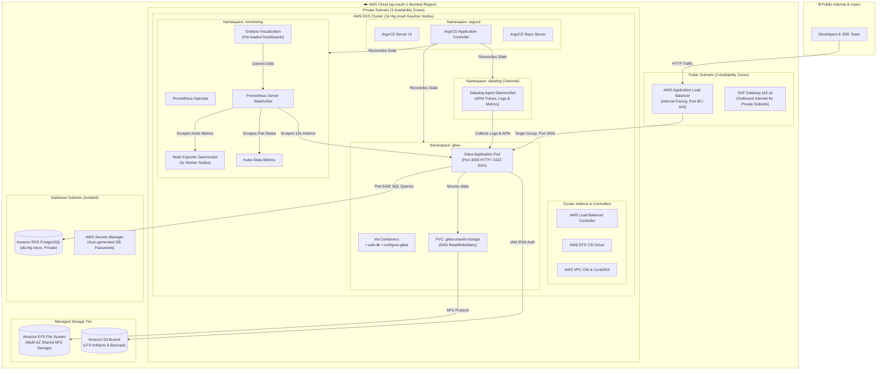
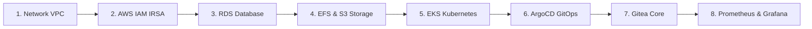
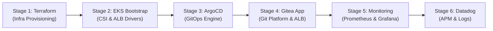

# 🚀 Enterprise Gitea Platform on AWS EKS with ArgoCD GitOps & Full Observability

[](https://aws.amazon.com/)
[](https://aws.amazon.com/eks/)
[](https://www.terraform.io/)
[](https://argo-cd.readthedocs.io/)
[](https://about.gitea.com/)
[](https://prometheus.io/)
[](https://grafana.com/)
[](https://www.datadoghq.com/)

A cost-optimized, enterprise-grade GitOps platform deploying **[Gitea](https://about.gitea.com/)** on **[Amazon Elastic Kubernetes Service (EKS)](https://aws.amazon.com/eks/)** in the **AWS Mumbai Region (`ap-south-1`)**. Managed via **[ArgoCD](https://argo-cd.readthedocs.io/)**, backed by **[Amazon RDS PostgreSQL](https://aws.amazon.com/rds/postgresql/)**, **[Amazon EFS Multi-AZ](https://aws.amazon.com/efs/)**, and **[Amazon S3](https://aws.amazon.com/s3/)**, and observed with **[Prometheus & Grafana](https://prometheus-community.github.io/helm-charts/)** and **[Datadog APM](https://docs.datadoghq.com/containers/kubernetes/)**.

---

## 🏛 1. End-to-End System Architecture



---

## 🧩 2. Serial Component Breakdown & Deep Dive

Each component in the platform is engineered to deliver high availability, enterprise security, and cost efficiency.



---

### 1️⃣ Networking Tier: Custom AWS VPC
* **Official Docs**: [Amazon Virtual Private Cloud Documentation](https://docs.aws.amazon.com/vpc/)
* **Why We Use It**: Complete network isolation across **3 Availability Zones (`ap-south-1a`, `ap-south-1b`, `ap-south-1c`)**.
* **Architecture**:
  * **Public Subnets**: Host the Internet-Facing AWS Application Load Balancer and single NAT Gateway.
  * **Private Subnets**: Host the EKS Worker Nodes and EFS Mount Targets (no direct internet exposure).
  * **Database Subnets**: Fully isolated subnets dedicated strictly to Amazon RDS PostgreSQL.
* **Cost Optimization**: Single shared NAT Gateway in AZ-a saves ~$65/month compared to multi-NAT setups.
* **Dependencies**: AWS Internet Gateway (IGW) and Route Tables.

---

### 2️⃣ Security & Identity: AWS IAM & IRSA (IAM Roles for Service Accounts)
* **Official Docs**: [AWS EKS IAM Roles for Service Accounts (IRSA)](https://docs.aws.amazon.com/eks/latest/userguide/iam-roles-for-service-accounts.html)
* **Why We Use It**: Eliminates hardcoded AWS access keys inside Kubernetes pods by binding IAM policies directly to Kubernetes ServiceAccounts via OpenID Connect (OIDC).
* **Where It Operates**:
  * `gitea-prod-alb-controller-irsa-role`: Grants AWS Load Balancer Controller permissions to manage ALBs, target groups, and listener rules.
  * `gitea-prod-efs-csi-irsa-role`: Grants AWS EFS CSI Driver permissions to dynamically create and mount EFS access points.
  * `gitea-prod-gitea-irsa-role`: Grants the Gitea core container permissions to read/write to the Amazon S3 storage bucket.
* **Dependencies**: AWS IAM OIDC Identity Provider on the EKS cluster.

---

### 3️⃣ Relational Database: Amazon RDS PostgreSQL
* **Official Docs**: [Amazon RDS for PostgreSQL](https://aws.amazon.com/rds/postgresql/)
* **Why We Use It**: Fully managed ACID-compliant relational database for Gitea users, repositories, pull requests, issue trackers, and permissions.
* **Where It Operates**: Deployed as an `AWS Graviton db.t4g.micro` instance in private database subnets.
* **Security**: Master database credentials are generated on-the-fly, encrypted with AWS KMS, and stored in **[AWS Secrets Manager](https://aws.amazon.com/secrets-manager/)**.
* **Dependencies**: Database Subnet Group, KMS Encryption Key, and Database Security Group allowing ingress from EKS worker nodes on port `5432`.

---

### 4️⃣ Persistent Storage: Amazon EFS Multi-AZ & Amazon S3
* **Official Docs**: [Amazon Elastic File System (EFS)](https://aws.amazon.com/efs/) & [Amazon Simple Storage Service (S3)](https://aws.amazon.com/s3/)
* **Why We Use It**: Hybrid storage tier decoupling hot Git repositories from cold attachments and backups.
  * **Amazon EFS (Multi-AZ)**: Shared POSIX-compliant NFS file system mounted at `/data` across all 3 Availability Zones with `ReadWriteMany` (RWX) access mode.
  * **Amazon S3**: High-durability object storage for Large File Storage (Git LFS), avatar uploads, and platform backups.
* **Dependencies**: AWS EFS Mount Targets in private subnets and AWS EFS CSI Driver on EKS.

---

### 5️⃣ Compute Engine: Amazon Elastic Kubernetes Service (EKS)
* **Official Docs**: [Amazon EKS User Guide](https://docs.aws.amazon.com/eks/)
* **Why We Use It**: Production Kubernetes control plane (v1.30) managing container lifecycles, self-healing, and auto-scaling.
* **Worker Node Architecture**:
  * 3x **AWS Graviton2 (`t4g.small`)** EC2 instances spanning 3 Availability Zones.
  * Cost: ~$0.0168/hour per node (~$12/month) providing 64-bit ARM architecture with optimal price-performance.
* **Dependencies**: AWS VPC CNI, CoreDNS, and Kube-Proxy add-ons.

---

### 6️⃣ GitOps Engine: ArgoCD
* **Official Docs**: [ArgoCD Official Documentation](https://argo-cd.readthedocs.io/)
* **Why We Use It**: Declarative continuous delivery platform implementing the **App-of-Apps** pattern.
* **Where It Operates**: Watches Helm charts and values in Git and automatically reconciles the live Kubernetes cluster state.
* **Features**: Automated drift detection, self-healing (`selfHeal: true`), and pruning (`prune: true`).
* **Dependencies**: EKS Cluster and Kubernetes API.

---

### 7️⃣ Application Layer: Gitea Enterprise Git Service
* **Official Docs**: [Gitea Documentation](https://docs.gitea.com/)
* **Why We Use It**: Lightweight, ultra-fast self-hosted Git service providing code hosting, code review, issue tracking, and webhooks.
* **Container Lifecycle**:
  ```mermaid
  sequenceDiagram
      autonumber
      participant K8s as Kubernetes Kubelet
      participant Init1 as init: wait-for-db
      participant Init2 as init: configure-gitea
      participant Core as container: gitea (Core)
      participant RDS as Amazon RDS PostgreSQL
      participant EFS as Amazon EFS (/data)

      K8s->>Init1: Boot wait-for-db container
      Init1->>RDS: TCP Ping on Port 5432
      RDS-->>Init1: Connection Established
      Init1-->>K8s: Exit 0 (Success)

      K8s->>Init2: Boot configure-gitea container
      Init2->>EFS: Generate /data/gitea/conf/app.ini
      Init2->>RDS: Sync admin user (gitea_admin)
      Init2-->>K8s: Exit 0 (Success)

      K8s->>Core: Boot main Gitea container
      Core->>EFS: Mount repositories & sessions
      Core->>RDS: Execute database migrations
      Core-->>K8s: HTTP 200 on /api/v1/version (Readiness Passed)
  ```
* **Dependencies**: Amazon RDS PostgreSQL, Amazon EFS PVC, and Kubernetes Secrets.

---

### 8️⃣ Observability: Prometheus, Grafana & Datadog
* **Official Docs**: [Prometheus](https://prometheus.io/), [Grafana](https://grafana.com/), [Datadog](https://docs.datadoghq.com/)
* **Prometheus Operator**: Automates scraping of EKS worker nodes (Node-Exporter), Kubernetes pod lifecycles (Kube-State-Metrics), Kubelet container metrics (cAdvisor), and Gitea `/metrics` on port 3000.
* **Grafana Dashboards**: Pre-loaded with official **Gitea Overview Dashboard (#14757)** and Kubernetes Cluster Health dashboards.
* **Datadog Agent**: Optional DaemonSet collecting distributed APM traces and unified container logs.

---

## 📂 3. Repository Directory Structure

```
gitea-platform/
├── argocd/
│   ├── env.conf.example             # Central configuration file for single-point edits
│   ├── root-application.yaml        # App-of-Apps root sync manifest
│   ├── applications/                # Independent ArgoCD Application CRDs
│   │   ├── gitea-app.yaml           # Gitea GitOps application definition
│   │   ├── monitoring-app.yaml      # Prometheus & Grafana stack application
│   │   └── datadog-app.yaml         # Datadog Agent application
│   └── values/                      # Modular Helm values
│       ├── gitea-values.yaml        # Gitea configuration (DB, S3, EFS, Ingress)
│       ├── monitoring-values.yaml   # Prometheus scraping & Grafana credentials
│       └── datadog-values.yaml      # Datadog APM, logs, and container metrics
├── terraform/
│   ├── modules/
│   │   ├── vpc/                     # 3-AZ VPC, subnets, IGW, 1 NAT Gateway
│   │   ├── eks/                     # EKS 1.30, 3 worker nodes, addons, OIDC
│   │   ├── rds/                     # db.t4g.micro PostgreSQL, Secrets Manager
│   │   ├── storage/                 # EFS Multi-AZ & S3 storage bucket
│   │   └── iam/                     # IRSA roles for Gitea, ALB Controller, EFS
│   ├── providers.tf                 # AWS, Helm, Kubernetes providers
│   ├── variables.tf                 # Configurable variables (defaults to ap-south-1)
│   ├── main.tf                      # Root orchestration & module linkage
│   ├── outputs.tf                   # Endpoints, ARNs, and connection strings
│   └── terraform.tfvars.example     # Example variable assignments
├── scripts/
│   ├── 01-infra-terraform.sh        # Stage 1: Terraform Cloud Infrastructure
│   ├── 02-eks-bootstrap.sh          # Stage 2: AWS EKS Drivers & Core CRDs
│   ├── 03-deploy-argocd.sh          # Stage 3: ArgoCD Server & CLI Setup
│   ├── 04-deploy-gitea.sh           # Stage 4: Gitea Application GitOps Pipeline
│   ├── 05-deploy-monitoring.sh      # Stage 5: Prometheus & Grafana Stack
│   ├── 06-deploy-datadog.sh         # Stage 6: Datadog Observability Stack
│   ├── reset-stage4.sh              # Fast 5-second teardown for Stage 4
│   ├── reset-stage5.sh              # Fast 5-second teardown for Stage 5
│   └── destroy.sh                   # Full AWS Cloud infrastructure teardown
├── .gitignore                       # Prevents secret leaks (tfstate, env.conf)
└── README.md                        # Platform documentation & operational guide
```

---

## 🚀 4. Deployment Pipeline (Stage-by-Stage)



### 📋 Step 0: Prerequisites
1. **[AWS CLI v2](https://docs.aws.amazon.com/cli/latest/userguide/install-cliv2.html)** configured (`aws configure` with region `ap-south-1`).
2. **[Terraform (>= 1.5.0)](https://developer.hashicorp.com/terraform/downloads)**
3. **[kubectl (>= 1.29)](https://kubernetes.io/docs/tasks/tools/)**
4. **[Helm v3](https://helm.sh/docs/intro/install/)**

---

### ☕ Stage 1: Deploy Cloud Infrastructure (Terraform)
Provisions the VPC, 3-node EKS cluster, RDS PostgreSQL, Multi-AZ EFS, S3 bucket, and IAM roles.

```bash
cd gitea-platform
./scripts/01-infra-terraform.sh
```

---

### 🔧 Stage 2: Bootstrap EKS Cluster & Drivers
Installs the AWS EFS CSI Driver, AWS Load Balancer Controller, and StorageClasses.

```bash
./scripts/02-eks-bootstrap.sh
```

---

### 🐙 Stage 3: Deploy ArgoCD GitOps Engine
Deploys ArgoCD and configures the initial administrative credentials.

```bash
./scripts/03-deploy-argocd.sh
```

---

### ☕ Stage 4: Deploy Gitea Application
Deploys Gitea via ArgoCD, binds the 50Gi Multi-AZ EFS volume, initializes RDS, and allocates the public AWS Application Load Balancer.

```bash
./scripts/04-deploy-gitea.sh
```

---

### 📈 Stage 5: Deploy Prometheus & Grafana Monitoring Stack
Installs Prometheus Operator, scrapes Gitea and EKS node metrics, and provisions Grafana with pre-loaded dashboards.

```bash
./scripts/05-deploy-monitoring.sh
```

---

### 🐶 Stage 6: Deploy Datadog Observability *(Optional)*
Configures the Datadog Agent DaemonSet on all 3 worker nodes.

```bash
# Add your API key in argocd/env.conf, then run:
./scripts/06-deploy-datadog.sh
```

---

## 🌐 5. Service Access & Verification Guide

| Service | Access Type | Connection Command / URL | Default Credentials |
| :--- | :--- | :--- | :--- |
| **Gitea Web UI** | **Public AWS ALB** | `http://<ALB-DNS-NAME>` *(Printed by Stage 4)* | **User**: `gitea_admin`<br>**Password**: `GiteaSecurePassword123!` |
| **Gitea (Local)** | Port-Forward | `kubectl port-forward svc/gitea-http -n gitea 3000:3000`<br>URL: `http://localhost:3000` | Same as above |
| **Grafana Dashboard** | Port-Forward | `kubectl port-forward svc/kube-prometheus-stack-grafana -n monitoring 3001:80`<br>URL: `http://localhost:3001` | **User**: `admin`<br>**Password**: `GrafanaSecurePassword123!` |
| **Prometheus Targets** | Port-Forward | `kubectl port-forward svc/prometheus-operated -n monitoring 9090:9090`<br>URL: `http://localhost:9090/targets` | *No Authentication Required* |
| **ArgoCD Server** | Port-Forward | `kubectl port-forward svc/argocd-server -n argocd 8080:80`<br>URL: `http://localhost:8080` | **User**: `admin`<br>**Password**: `kubectl -n argocd get secret argocd-initial-admin-secret -o jsonpath="{.data.password}" \| base64 -d` |

---

## 🧹 6. Teardown & Reset Utilities

### ⚡ Fast Reset Stage 4 (Gitea Application Teardown - 5 Seconds)
Wipes only the Gitea Kubernetes deployment without touching your AWS infrastructure or RDS database:
```bash
./scripts/reset-stage4.sh
```

### ⚡ Fast Reset Stage 5 (Monitoring Stack Teardown - 5 Seconds)
Wipes only the Prometheus & Grafana stack without touching Gitea or EKS:
```bash
./scripts/reset-stage5.sh
```

### 💥 Complete Cloud Teardown (Destroy All Infrastructure)
Deletes all Kubernetes resources, RDS databases, EFS storage, EKS clusters, and VPCs to prevent ongoing AWS billing:
```bash
./scripts/destroy.sh
```

---

## 💰 7. Monthly AWS Cost Breakdown

| Component | AWS Resource Type | Monthly Estimate (ap-south-1) | Cost Optimization Strategy |
| :--- | :--- | :---: | :--- |
| **EKS Control Plane** | AWS Managed Kubernetes | $73.00 | High-availability SLA backed control plane |
| **Worker Nodes (3x)** | EC2 `t4g.small` (ARM64) | ~$36.60 | 3-AZ resilience at ~$0.0168/hour per node |
| **Relational Database** | RDS PostgreSQL `db.t4g.micro` | ~$12.50 | Graviton2 processor, private subnet isolation |
| **Network Address Translation** | Single NAT Gateway (AZ-a) | ~$32.00 | Single shared NAT saves ~$65/mo vs multi-NAT |
| **Shared Persistent Storage** | Amazon EFS Multi-AZ (50Gi) | ~$8.00 | Pay-per-use Elastic throughput |
| **Object Storage** | Amazon S3 Standard | ~$0.50 | S3 Intelligent-Tiering for LFS & backups |
| **Application Load Balancer** | AWS ELB (ALB) | ~$18.00 | Single internet-facing entrypoint for all services |
| **Total Estimated Cost** | — | **~$180.60 / month** | **Over 60% savings vs x86 multi-NAT architectures** |

---

## 📜 8. License & Acknowledgements

* Built with ❤️ for SRE & DevOps teams.
* **Gitea**: Licensed under the [MIT License](https://github.com/go-gitea/gitea/blob/main/LICENSE).
* **Prometheus Community**: Licensed under the [Apache 2.0 License](https://github.com/prometheus-community/helm-charts/blob/main/LICENSE).
