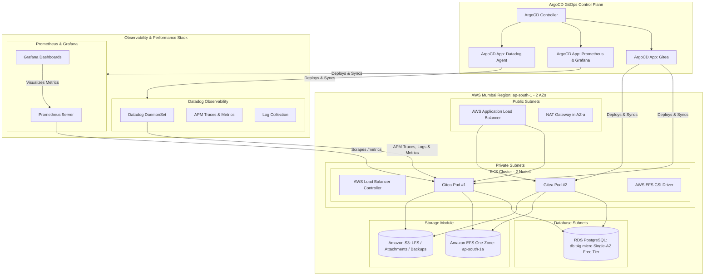

# Gitea Platform on AWS EKS (`ap-south-1`) with Modular ArgoCD & Observability

Cost-optimized, modular Infrastructure-as-Code (Terraform) and GitOps deployment configuration for [Gitea](https://about.gitea.com/) on Amazon Elastic Kubernetes Service (EKS) in the **AWS Mumbai region (`ap-south-1`)**, complete with **Prometheus & Grafana** and **Datadog APM & Metrics**.

---

## 🏛 System Architecture



---

## 📁 Modular Directory Layout

```
gitea-platform/
├── argocd/
│   ├── env.conf.example             # Central configuration file for single-point edits
│   ├── root-application.yaml        # App-of-Apps root sync
│   ├── applications/                # Independent ArgoCD Application CRDs
│   │   ├── gitea-app.yaml           # Gitea GitOps application
│   │   ├── monitoring-app.yaml      # Prometheus & Grafana stack application
│   │   └── datadog-app.yaml         # Datadog Agent application
│   └── values/                      # Modular Helm values
│       ├── gitea-values.yaml        # Gitea configuration (DB, S3, EFS, Ingress)
│       ├── monitoring-values.yaml   # Prometheus scraping & Grafana credentials
│       └── datadog-values.yaml      # Datadog APM, logs, and container metrics
├── terraform/
│   ├── modules/
│   │   ├── vpc/                     # 2-AZ VPC, subnets, IGW, 1 NAT Gateway
│   │   ├── eks/                     # EKS 1.30, 2 worker nodes, addons, OIDC
│   │   ├── rds/                     # db.t4g.micro Single-AZ PostgreSQL, Secrets Manager
│   │   ├── storage/                 # EFS One-Zone (ap-south-1a) & S3 bucket
│   │   └── iam/                     # IRSA roles & policies for Gitea, ALB, EFS
│   ├── providers.tf                 # AWS, Helm, K8s, TLS providers
│   ├── variables.tf                 # Input variables (defaults to ap-south-1, 2 AZs)
│   ├── main.tf                      # Root orchestration + ArgoCD Helm Release
│   ├── outputs.tf                   # Useful outputs (endpoints, ARNs, kubeconfig)
│   └── terraform.tfvars.example     # Example variable assignments
├── k8s/
│   ├── efs-storageclass.yaml        # Dynamic EFS Provisioner StorageClass
│   └── alb-ingress.yaml             # AWS ALB Ingress template
├── scripts/
│   ├── deploy.sh                    # Automated end-to-end deploy script
│   └── destroy.sh                   # Infrastructure teardown script
└── README.md                        # Platform documentation
```

---

## ⚙️ Centralized Configuration (`argocd/env.conf`)

You can pass and customize any configuration value without modifying the Kubernetes manifests or code. Simply copy `argocd/env.conf.example` to `argocd/env.conf`:

```bash
cp argocd/env.conf.example argocd/env.conf
```

Inside `argocd/env.conf`:
```bash
# Application Domains
GITEA_DOMAIN="git.example.com"
ARGOCD_DOMAIN="argocd.example.com"
GRAFANA_DOMAIN="grafana.example.com"

# Grafana Admin Credentials
GRAFANA_ADMIN_USER="admin"
GRAFANA_ADMIN_PASSWORD="YourGrafanaPassword123!"

# Datadog Observability
DATADOG_ENABLED="true"
DATADOG_SITE="datadoghq.com"
DATADOG_API_KEY="your-datadog-api-key"
DATADOG_APP_KEY="your-datadog-app-key"

# Prometheus Retention
PROMETHEUS_RETENTION_DAYS="7"
```

---

## 🚀 Quick Start (Single Command)

### 1. Prerequisites
- [AWS CLI v2](https://docs.aws.amazon.com/cli/latest/userguide/install-cliv2.html) (`aws configure` targeting `ap-south-1`)
- [Terraform (>= 1.5.0)](https://developer.hashicorp.com/terraform/downloads)
- [kubectl (>= 1.29)](https://kubernetes.io/docs/tasks/tools/)
- [Helm v3](https://helm.sh/docs/intro/install/)

### 2. Deploy Infrastructure & Applications
Run the automated deployment script:
```bash
./scripts/deploy.sh
```

---

## 📊 Access Dashboards & Monitoring

### 1. 🐙 ArgoCD GitOps Dashboard
```bash
kubectl port-forward svc/argocd-server -n argocd 8080:80
```
- **URL**: `http://localhost:8080`
- **Username**: `admin`
- **Password**: Retrieved automatically by `deploy.sh` or run:
  ```bash
  kubectl -n argocd get secret argocd-initial-admin-secret -o jsonpath="{.data.password}" | base64 -d && echo
  ```

### 2. 📈 Grafana Dashboards
```bash
kubectl port-forward svc/kube-prometheus-stack-grafana -n monitoring 3001:80
```
- **URL**: `http://localhost:3001`
- **Username**: `admin`
- **Password**: As set in `argocd/env.conf` (default: `GrafanaSecurePassword123!`)
- **Included Dashboards**: EKS Cluster Metrics, Node Exporter, and Gitea metrics scraped from `/metrics`.

### 3. ☕ Gitea Web UI
```bash
kubectl port-forward svc/gitea-http -n gitea 3000:3000
```
- **URL**: `http://localhost:3000` (or via AWS ALB Ingress address: `kubectl get ingress -n gitea`)

### 4. 🐶 Datadog APM & Metrics
- Verify Datadog DaemonSet pods running on worker nodes:
  ```bash
  kubectl get daemonset -n datadog
  ```
- Check Agent status and active checks (APM, Logs, Prometheus Scraper):
  ```bash
  kubectl exec -it -n datadog $(kubectl get pods -n datadog -l app.kubernetes.io/name=datadog -o jsonpath='{.items[0].metadata.name}') -c agent -- agent status
  ```

---

## 🧹 Teardown / Cleanup

To delete all infrastructure and avoid unnecessary AWS charges:
```bash
./scripts/destroy.sh
```
