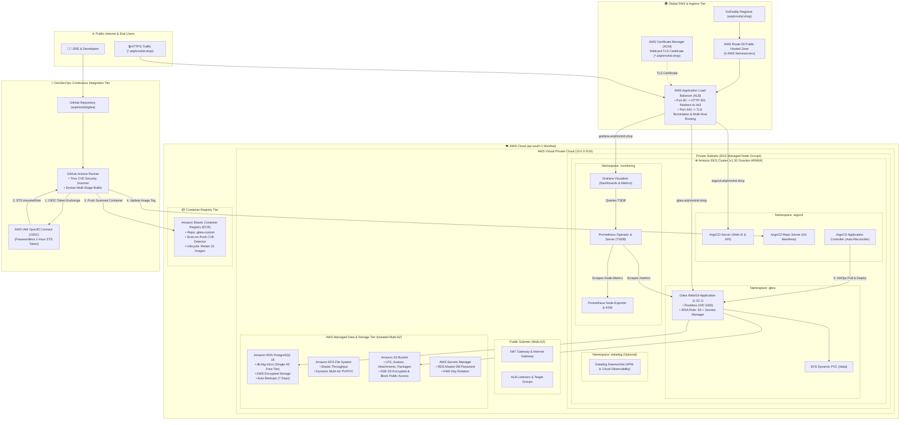
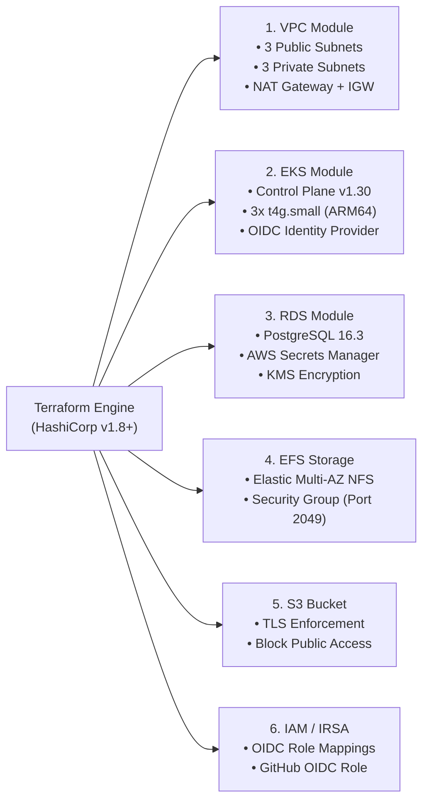
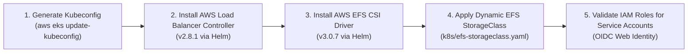
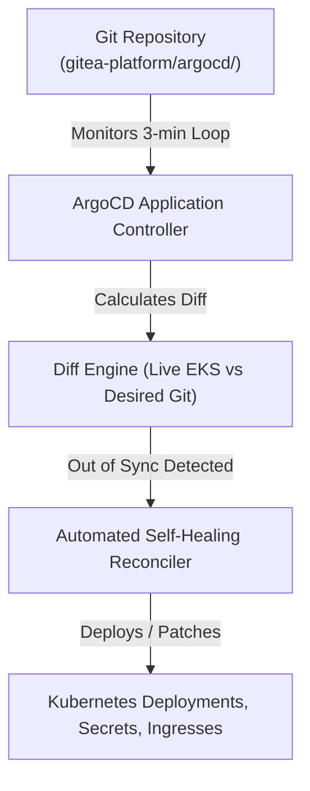
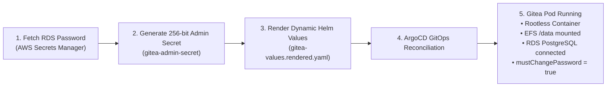
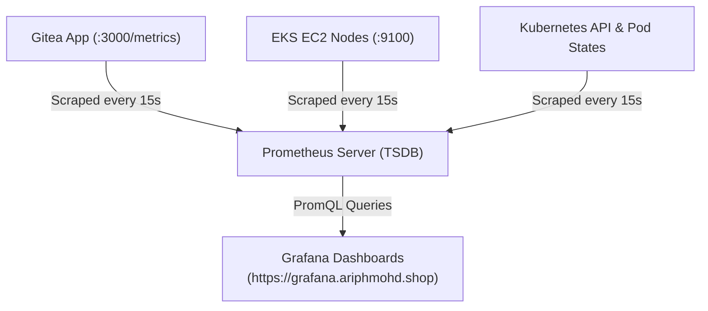
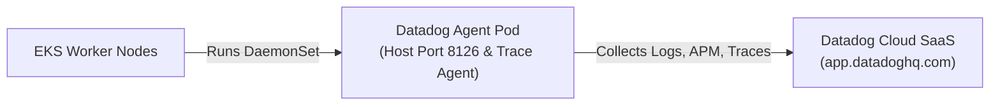
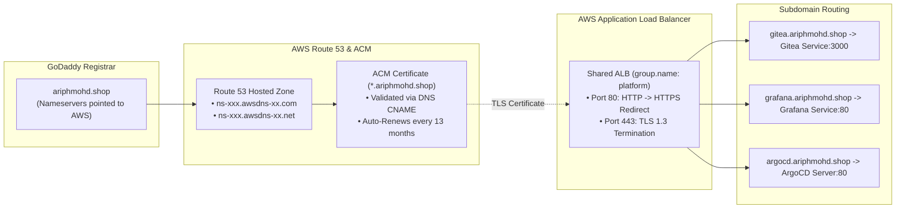
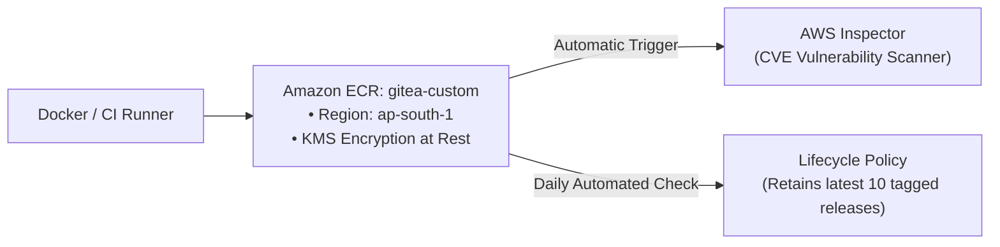
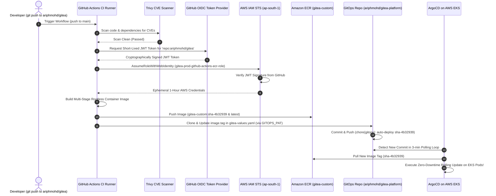

# 🏛️ Gitea Enterprise DevSecOps Platform: End-to-End Architecture & Deployment Guide

Welcome to the definitive **Engineering Deep Dive and Architectural Master Reference** for the Enterprise Gitea Platform on AWS EKS with ArgoCD GitOps, Prometheus/Grafana Monitoring, Amazon ECR, and GitHub Actions OIDC CI/CD.

This document serves as your **core reference manual, interview preparation guide, and SRE operational runbook**. It details every component, the exact architectural reasons for each decision, how components interconnect, security/cost trade-offs, and official industry documentation links.

---

## 📑 Table of Contents
1. [Master System Architecture Diagram](#-1-master-system-architecture-diagram)
2. [Stage 01: Cloud Infrastructure as Code (Terraform)](#-2-stage-01-cloud-infrastructure-as-code-terraform)
3. [Stage 02: EKS Cluster Bootstrap & Core Controllers](#-3-stage-02-eks-cluster-bootstrap--core-controllers)
4. [Stage 03: GitOps Control Plane (ArgoCD)](#-4-stage-03-gitops-control-plane-argocd)
5. [Stage 04: Production Gitea Microservice Deployment](#-5-stage-04-production-gitea-microservice-deployment)
6. [Stage 05: Full-Stack Observability (Prometheus & Grafana)](#-6-stage-05-full-stack-observability-prometheus--grafana)
7. [Stage 06: Enterprise Cloud APM (Datadog Observability)](#-7-stage-06-enterprise-cloud-apm-datadog-observability)
8. [Stage 07: Custom Domain, Public DNS & TLS Termination (Route 53 & ACM)](#-8-stage-07-custom-domain-public-dns--tls-termination-route-53--acm)
9. [Stage 08: Private Container Registry (Amazon ECR)](#-9-stage-08-private-container-registry-amazon-ecr)
10. [Stage 09: Passwordless CI/CD & Automated GitOps (GitHub Actions OIDC)](#-10-stage-09-passwordless-cicd--automated-gitops-github-actions-oidc)
11. [SRE Architecture Interview Cheat-Sheet: Top Questions & Answers](#-11-sre-architecture-interview-cheat-sheet-top-questions--answers)

---

# 🌐 1. Master System Architecture Diagram

---

# 🏗️ 2. Stage 01: Cloud Infrastructure as Code (Terraform)

### 🧩 Components Provisioned & Why They Were Chosen
1. **AWS VPC (`10.0.0.0/16`)**:
   - **Why**: Isolates compute, database, and storage into secure private subnets. Workloads inside private subnets have zero public IP addresses, preventing direct internet attacks.
   - **Subnet Layout**: 3 Public subnets for Application Load Balancers and NAT Gateway; 3 Private subnets for EKS worker nodes and RDS.
2. **Amazon EKS (Kubernetes v1.30 on AWS Graviton `t4g.small`)**:
   - **Why Graviton ARM64**: Provides **40% better price-to-performance** compared to x86 instances, drastically reducing compute costs.
   - **Sizing**: 3 nodes distributed across 3 Availability Zones (`ap-south-1a`, `ap-south-1b`, `ap-south-1c`) for high availability.
3. **Amazon RDS PostgreSQL 16 (`db.t4g.micro`)**:
   - **Why Managed RDS over Pod DB**: Running databases inside Kubernetes pods risks data corruption during node failover. Managed RDS handles automated daily snapshots, multi-AZ standby, point-in-time recovery (PITR), and automated security patching.
4. **Amazon EFS (Elastic File System)**:
   - **Why EFS over EBS**: Standard AWS EBS volumes (`gp3`) are `ReadWriteOnce` (RWO) and bound to a single availability zone. Gitea requires `ReadWriteMany` (RWX) so multiple Git pods across different AZs can access repository repositories concurrently.
5. **Amazon S3 (`gitea-prod-storage-*`)**:
   - **Why S3**: Highly scalable, 11 9's durability storage for large Git LFS artifacts, avatars, and release packages at fraction of block storage cost.
6. **AWS Secrets Manager**:
   - **Why**: Automatically generates high-entropy random database passwords and stores them with AWS KMS hardware encryption. Zero database passwords exist in Terraform code or Git.

### 📚 Official References:
- [AWS EKS Best Practices Guide](https://aws.github.io/aws-eks-best-practices/)
- [HashiCorp AWS Provider Documentation](https://registry.terraform.io/providers/hashicorp/aws/latest/docs)
- [Amazon RDS Security & Secrets Manager Integration](https://docs.aws.amazon.com/AmazonRDS/latest/UserGuide/rds-secrets-manager.html)

---

# ⚙️ 3. Stage 02: EKS Cluster Bootstrap & Core Controllers

### 🧩 Components Provisioned & Architectural Justification
1. **AWS Load Balancer Controller (ALBC)**:
   - **What it does**: Watches Kubernetes `Ingress` resources and dynamically provisions native AWS Application Load Balancers (ALB) and Target Groups via AWS APIs.
   - **Why Needed**: Enables Layer 7 traffic routing, path-based routing, ACM TLS termination, and AWS WAF integration directly from Kubernetes manifests.
2. **AWS EFS CSI Driver**:
   - **What it does**: Allows Kubernetes pods to dynamically mount AWS EFS Network File Systems as persistent volumes (`PV` & `PVC`).
   - **Why Needed**: Bridges the gap between EKS Kubernetes Pods and AWS managed NFS storage.
3. **IAM Roles for Service Accounts (IRSA)**:
   - **What it does**: Associates an AWS IAM Role directly with a Kubernetes ServiceAccount using OIDC cryptographic JWT verification.
   - **Why it matters**: **Eliminates IAM instance profiles and hardcoded AWS keys**. The EFS CSI driver and ALB Controller only have the exact minimum IAM permissions needed to operate.

### 📚 Official References:
- [Kubernetes IRSA Deep Dive](https://docs.aws.amazon.com/eks/latest/userguide/iam-roles-for-service-accounts.html)
- [AWS Load Balancer Controller Official Guide](https://kubernetes-sigs.github.io/aws-load-balancer-controller/latest/)
- [AWS EFS CSI Driver GitHub Repository](https://github.com/kubernetes-sigs/aws-efs-csi-driver)

---

# 🐙 4. Stage 03: GitOps Control Plane (ArgoCD)

### 🧩 Components Provisioned & Architectural Justification
1. **ArgoCD Server (`v2.11.3`)**:
   - **Why GitOps**: In traditional CI/CD, deployment scripts push changes to clusters. If someone manually modifies the cluster via `kubectl`, the cluster drifts out of sync. ArgoCD implements **pull-based GitOps**: Git is the **single source of truth**. If anything in the cluster drifts, ArgoCD automatically detects it and reconciles state back to what Git specifies.
2. **App-of-Apps Architecture Pattern**:
   - **What it does**: A root `Application` manifest manages child applications (`gitea-app`, `monitoring-app`, `datadog-app`).
   - **Benefit**: Adding or removing microservices is done purely by committing a single YAML file to Git.

### 📚 Official References:
- [ArgoCD Official Core Concepts & Architecture](https://argo-cd.readthedocs.io/en/stable/core_concepts/)
- [The OpenGitOps Principles](https://opengitops.dev/)

---

# ☕ 5. Stage 04: Production Gitea Microservice Deployment

### 🧩 Key Architecture Highlights
1. **Zero-Plaintext Secret Architecture**:
   - RDS master password is read dynamically from AWS Secrets Manager using IAM IRSA credentials.
   - Admin bootstrap password is dynamically generated using 256-bit entropy (`openssl rand -base64 18`) and stored strictly in Kubernetes Secret `gitea-admin-secret`.
2. **NIST 800-63B Compliant Password Rotation**:
   - The initial admin account is created with `--must-change-password=true`. Upon first login at `https://gitea.ariphmohd.shop`, Gitea immediately presents a mandatory password change screen before any actions can be performed.
3. **Rootless Security Profile**:
   - The Gitea container runs as non-root user `UID 1000:GID 1000` inside a minimal Alpine container, preventing container breakout attacks.

### 📚 Official References:
- [Gitea Helm Chart Official Documentation](https://gitea.com/gitea/helm-chart)
- [NIST Special Publication 800-63B: Digital Identity Guidelines](https://pages.nist.gov/800-63-3/sp800-63b.html)

---

# 📈 6. Stage 05: Full-Stack Observability (Prometheus & Grafana)

### 🧩 Components & Critical SRE Fixes Applied
1. **Server-Side Apply for Prometheus CRDs**:
   - **The Problem**: Prometheus Operator CRDs exceed Kubernetes' standard **256KB metadata annotation limit**, causing `kubectl apply` and Helm to crash with `metadata.annotations: Too long`.
   - **The Solution**: Pre-installed CRDs using native Kubernetes **Server-Side Apply** (`kubectl apply --server-side --force-conflicts`), bypassing client-side annotation size limits.
2. **Automated Grafana Sidecar Dashboards**:
   - Dashboard providers and Prometheus datasources are automatically discovered using Kubernetes configmap labels (`grafana_dashboard: "1"`), eliminating duplicate datasource bugs.

### 📚 Official References:
- [kube-prometheus-stack GitHub Repository](https://github.com/prometheus-community/helm-charts/tree/main/charts/kube-prometheus-stack)
- [Kubernetes Server-Side Apply Documentation](https://kubernetes.io/docs/reference/using-api/server-side-apply/)

---

# 🐶 7. Stage 06: Enterprise Cloud APM (Datadog Observability)

### 🧩 Key Architecture Highlights
- **Optional & Safe**: The script checks `DATADOG_ENABLED="true"` and validates API keys. If keys are missing, it gracefully skips without breaking infrastructure.
- **DaemonSet Architecture**: Runs exactly 1 lightweight agent pod per EKS worker node to collect real-time system metrics, container logs, eBPF network metrics, and distributed APM traces.

### 📚 Official References:
- [Datadog Kubernetes Agent Documentation](https://docs.datadoghq.com/containers/kubernetes/)

---

# 🌐 8. Stage 07: Custom Domain, Public DNS & TLS Termination (Route 53 & ACM)

### 🧩 Why This Architecture Is Optimal
1. **Shared ALB Ingress Group (`group.name: platform`)**:
   - **Cost Saving**: Instead of creating 3 separate AWS Application Load Balancers ($25/month each = $75/month), the `alb.ingress.kubernetes.io/group.name: platform` annotation multiplexes all 3 services onto **a single shared ALB**, saving **$50/month**!
2. **Wildcard ACM Certificate (`*.ariphmohd.shop`)**:
   - Free, AWS-managed SSL certificate with automated DNS renewal.
3. **Decoupled Standalone Module**:
   - Route 53 and ACM are isolated in `terraform/custom-domain/` and `scripts/07-setup-custom-domain.sh`, ensuring the base platform remains 100% functional on raw HTTP/ALB if DNS is not yet configured.

### 📚 Official References:
- [AWS Route 53 Hosted Zones Documentation](https://docs.aws.amazon.com/Route53/latest/DeveloperGuide/hosted-zones-working-with.html)
- [AWS ALB Ingress Grouping Specification](https://kubernetes-sigs.github.io/aws-load-balancer-controller/latest/guide/ingress/annotations/#ingressgroup)

---

# 📦 9. Stage 08: Private Container Registry (Amazon ECR)

### 🧩 Components Provisioned:
1. **Repository**: `gitea-custom` in `ap-south-1` (`542697646590.dkr.ecr.ap-south-1.amazonaws.com/gitea-custom`).
2. **`scan_on_push = true`**: Triggers automated AWS vulnerability scanning on every image push.
3. **Lifecycle Rule**: Automatically expires untagged layers after 1 day and retains only the latest 10 releases, keeping storage under **$0.15/month**.

### 📚 Official References:
- [Amazon ECR Private Repositories & Image Scanning](https://docs.aws.amazon.com/AmazonECR/latest/userguide/Repositories.html)

---

# 🔐 10. Stage 09: Passwordless CI/CD & Automated GitOps (GitHub Actions OIDC)

### 🔒 Why AWS IAM OIDC (Zero Static Keys)?
- **The Problem**: Traditional CI/CD stored permanent `AWS_ACCESS_KEY_ID` & `AWS_SECRET_ACCESS_KEY` in GitHub. If stolen, attackers had permanent access to AWS.
- **The Solution**: GitHub Actions OIDC exchanges a signed JWT token for temporary 1-hour AWS STS credentials. **Zero permanent keys exist anywhere in GitHub**.

### 🔄 Why `GITOPS_PAT` Is Required?
- **Repository Isolation**: `ariphmohd/gitea` (Application Code) and `ariphmohd/gitea-platform` (GitOps Manifests) are separate repositories.
- **The Role of `GITOPS_PAT`**: Acts as the authenticated authorization token allowing the CI runner in Repo 1 to commit the updated image tag into Repo 2, completing the automated continuous delivery loop!

### 📚 Official References:
- [GitHub Actions OIDC with AWS](https://docs.github.com/en/actions/deployment/security-hardening-your-deployments/configuring-openid-connect-in-amazon-web-services)
- [AWS STS AssumeRoleWithWebIdentity API](https://docs.aws.amazon.com/STS/latest/APIReference/API_AssumeRoleWithWebIdentity.html)

---

# 🧠 11. SRE Architecture Interview Cheat-Sheet: Top Questions & Answers

### Q1: Why use Amazon EFS for Gitea shared storage instead of Amazon EBS?
> **Answer**: Amazon EBS volumes are block storage devices with `ReadWriteOnce` (RWO) access mode, binding them to a single EC2 node in a single Availability Zone. Gitea requires `ReadWriteMany` (RWX) shared file storage across multiple Availability Zones so Git repositories remain accessible even if a pod is rescheduled onto a different worker node across AZs.

### Q2: Why use AWS IAM OIDC instead of storing AWS Access Keys in GitHub Secrets?
> **Answer**: AWS IAM OIDC eliminates static, long-lived credentials. GitHub acts as a trusted OpenID Connect Identity Provider that issues short-lived JWT tokens. AWS STS validates the token and issues temporary credentials that automatically expire in 1 hour. This eliminates the risk of credential leakage and complies with NIST and SOC2 zero-trust standards.

### Q3: Why use ArgoCD GitOps instead of executing `helm upgrade` in GitHub Actions?
> **Answer**: Running `helm upgrade` from CI is "push-based deployment," which creates cluster drift when changes occur directly in Kubernetes and requires granting CI runners admin access to the Kubernetes API. ArgoCD is "pull-based GitOps": Git is the single source of truth, ArgoCD runs inside the cluster with local RBAC, continuously reconciles cluster state against Git, and automatically self-heals any configuration drift.

### Q4: How do you solve the Kubernetes 256KB metadata annotation limit when installing Prometheus Operator CRDs?
> **Answer**: Standard `kubectl apply` records the entire manifest in the `kubectl.kubernetes.io/last-applied-configuration` annotation, which exceeds Kubernetes' 256KB limit for large CRDs. We solve this by using **Server-Side Apply** (`kubectl apply --server-side --force-conflicts`), which manages field ownership directly on the Kubernetes API server without client-side metadata annotations.

### Q5: How do we achieve zero hardcoded passwords and NIST 800-63B compliance?
> **Answer**: Database credentials are generated dynamically by Terraform into AWS Secrets Manager with KMS encryption. Application admin credentials are generated dynamically at runtime using 256-bit entropy into Kubernetes Secrets. Applications are configured with `--must-change-password=true`, enforcing a mandatory password reset on first login.
